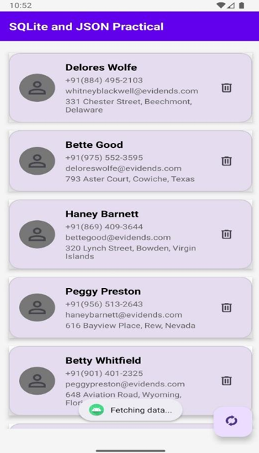
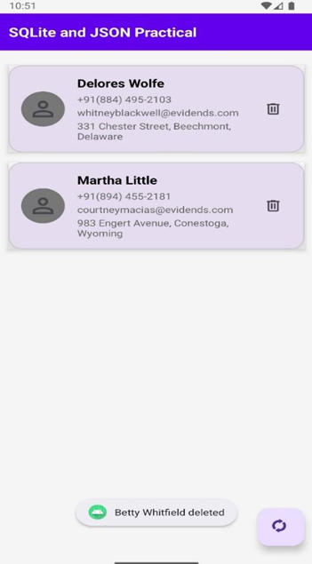

# SQLite and JSON Data Manager

An Android application demonstrating SQLite database operations with JSON API integration, featuring a person directory with CRUD operations.

## Features

- Fetch data from JSON API endpoint
- Store data in local SQLite database
- Display persons in RecyclerView with Material Cards
- Delete individual records
- Refresh data from API
- Network operations with coroutines
- Material Design UI components
- Edge-to-edge display support

## Tech Stack

- **Kotlin** - Primary programming language
- **SQLite** - Local database storage
- **Android XML Layouts** - UI design
- **Coroutines** - Asynchronous operations
- **Material Components** - Material Design UI elements
- **RecyclerView** - Efficient list display
- **HTTP Networking** - API communication

## Project Structure

```
com.example.a23012011153_practical_7
├── MainActivity.kt              # Main activity with RecyclerView
├── DatabaseHelper.kt            # SQLite database operations
├── HttpRequest.kt               # HTTP networking helper
├── PersonAdapter.kt             # RecyclerView adapter
├── Person.kt                    # Data model class
├── PersonDbTableData.kt         # Database schema
└── res
    └── layout
        ├── activity_main.xml    # Main screen layout
        └── person_item.xml      # RecyclerView item layout
```

## Screens

<div align="center">
  <table>
    <tr>
      <td align="center"><b>Person List</b></td>
      <td align="center"><b>Loading Card</b></td>
    </tr>
    <tr>
      <td></td>
      <td></td>
    </tr>
  </table>
</div>

## Database Schema

### Persons Table

| Column Name | Data Type | Description |
|------------|-----------|-------------|
| id | TEXT | Primary key |
| person_name | TEXT | Full name |
| person_email_id | TEXT | Email address |
| person_phone_no | TEXT | Phone number |
| person_address | TEXT | Street address |
| person_lat | REAL | GPS latitude |
| person_long | REAL | GPS longitude |

## JSON Data Structure

The app fetches data from MyJSON API with the following structure:

```json
{
  "data": [
    {
      "id": "unique_id",
      "email": "email@example.com",
      "phone": "+919876543210",
      "profile": {
        "name": "Person Name",
        "address": "Street Address, City, State",
        "location": {
          "lat": 23.0225,
          "long": 72.5714
        }
      }
    }
  ]
}
```

## Key Components

### MainActivity
- Initializes RecyclerView with LinearLayoutManager
- Loads persons from SQLite on startup
- Fetches data from API when refresh button clicked
- Handles network operations with Coroutines
- Manages database operations through DatabaseHelper

### DatabaseHelper
- Extends SQLiteOpenHelper
- Implements CRUD operations:
  - `insertPerson()` - Add new person
  - `getPerson()` - Retrieve single person
  - `allPersons` - Get all persons
  - `updatePerson()` - Update existing person
  - `deletePerson()` - Remove person
- Handles database creation and upgrades

### HttpRequest
- Makes HTTP GET requests to JSON API
- Handles connection timeouts and errors
- Converts response stream to string
- Comprehensive error logging

### PersonAdapter
- RecyclerView.Adapter implementation
- Displays person details in Material Cards
- Handles delete button clicks
- Updates UI when data changes

## Getting Started

### Prerequisites
- Android Studio (latest version recommended)
- Android SDK (minimum SDK 21)
- Kotlin plugin
- Internet connection for API access

### Installation

1. Clone the repository
2. Open the project in Android Studio
3. Add required drawable resources:
   - `person_24px.png` - Profile icon
   - `delete_24px.png` - Delete icon
   - `directory_sync_24px.png` - Refresh icon
   - `round_shape.xml` - Circle background drawable
4. Update API URL in MainActivity if needed
5. Sync Gradle files
6. Run the application

### Permissions

Add to AndroidManifest.xml:
```xml
<uses-permission android:name="android.permission.INTERNET" />
<uses-permission android:name="android.permission.ACCESS_NETWORK_STATE" />
```

### Dependencies

```gradle
dependencies {
    implementation 'androidx.core:core-ktx:1.12.0'
    implementation 'androidx.appcompat:appcompat:1.6.1'
    implementation 'com.google.android.material:material:1.11.0'
    implementation 'androidx.constraintlayout:constraintlayout:2.1.4'
    implementation 'androidx.recyclerview:recyclerview:1.3.2'
    implementation 'org.jetbrains.kotlinx:kotlinx-coroutines-android:1.7.3'
}
```

## Usage Flow

1. App launches and loads existing data from SQLite database
2. If database is empty, automatically fetches data from API
3. Displays persons in RecyclerView with Material Cards
4. Each card shows: name, phone, email, and address
5. Tap delete button to remove a person from database
6. Tap floating action button to refresh data from API
7. New data replaces existing database records

## API Configuration

Current API endpoint:
```kotlin
private const val JSON_URL = "https://api.myjson.online/v1/records/6dc50a82-6d2d-4ddd-ac22-709d2c0cb7b5"
```

To use your own JSON data:
1. Create JSON data at [MyJSON.online](https://myjson.online)
2. Replace the URL in MainActivity
3. Ensure JSON structure matches the expected format

## Error Handling

- Network timeout: 15 seconds
- Connection failures logged to Logcat
- Toast messages for user feedback
- Graceful handling of JSON parsing errors
- Empty response validation

## Material Design Elements

- MaterialCardView with elevation and rounded corners
- FloatingActionButton for refresh action
- Material color scheme (purple theme)
- Ripple effects on clickable items
- 16dp corner radius on cards
- Consistent padding and margins

## Author

**Aashish Sah**  
- GitHub: [@aashishsah005](https://github.com/aashishsah005)
- Email: aashishsah005@gmail.com

---

## Acknowledgments

- Android SQLite Documentation
- Material Design Guidelines
- Kotlin Coroutines Documentation
- Stack Overflow Community
- MyJSON.online for free JSON hosting

---

## Support

If you found this project helpful, please give it a ⭐ on GitHub!

---